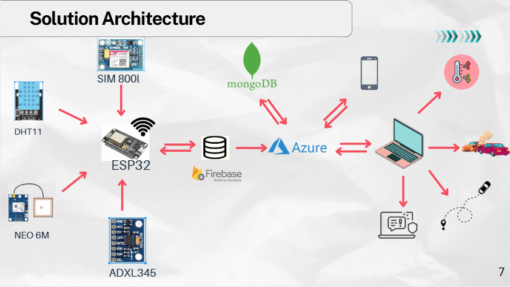

# Smart Vehicle Tracking and Management System

**"The Smart Way to Drive"**

## Introduction

The **Smart Vehicle Tracking and Management System** leverages cutting-edge IoT and sensor technologies to enhance vehicle safety and operational efficiency. It integrates real-time tracking, accident detection, and notifications for unauthorized disconnections, ensuring comprehensive vehicle and cargo management. Combining GPS, GSM, accelerometer, and cloud solutions, this system addresses critical challenges in the transportation sector while providing cost-effective and scalable monitoring capabilities.

## Key Features

- **Real-Time Vehicle Tracking:** Monitor vehicle locations with GPS precision and live updates.
- **Accident Detection:** Instantly alerts administrators and emergency contacts in the event of an accident.
- **Unauthorized Disconnection Alerts:** Immediate notifications for tampering or unauthorized device disconnections.
- **Environmental Monitoring:** Continuous tracking of cargo temperature and humidity conditions.
- **Administrative Control:** Comprehensive admin panel for efficient vehicle fleet and data management.
- **Mobile Accessibility:** Cross-platform mobile application for on-the-go monitoring and management.

## Problem Statement

Current vehicle management systems often lack affordable, comprehensive solutions for real-time tracking and operational management. Many existing solutions are either too expensive for small-to-medium enterprises or lack the integration of multiple monitoring capabilities. This project bridges that gap by providing an integrated, cost-effective solution that improves safety, operational efficiency, and data-driven decision-making for cargo and fleet operations.

## Solution Architecture

The system is built around a robust combination of hardware and software:

### Hardware Components

- **ESP32 Microcontroller**

  Central processing unit that handles sensor data collection, communication protocols, and real-time data processing.

- **GPS Sensor**

  Provides accurate real-time vehicle location tracking with precise coordinates and movement patterns.

- **GSM Module**

  Enables seamless communication between the vehicle unit and cloud servers, facilitating real-time data transmission and instant alert notifications via cellular networks.

- **Accelerometer Sensor (MPU6050)**

  Detects sudden acceleration changes, impact forces, and vehicle orientation for comprehensive accident detection and analysis.

- **Tamper Sensor**

  Security component that triggers immediate alerts when unauthorized device disconnections or tampering attempts are detected.

- **Temperature & Humidity Sensors (DHT11)**

  Continuously monitors cargo environmental conditions to ensure optimal storage and transport settings.

### Software Stack

| Category                   | Technologies/Tools Used                                      |
| -------------------------- | ------------------------------------------------------------ |
| **Frontend**               | React.js, HTML5, CSS3, JavaScript, Vite                      |
| **Backend**                | Node.js, Express.js, RESTful APIs                            |
| **Mobile App Development** | React Native, Expo                                           |
| **Database**               | Firebase Realtime Database, MongoDB                          |
| **Cloud & Deployment**     | Azure Cloud Platform, GitHub Actions (CI/CD)                 |
| **IoT Hardware**           | ESP32, GPS Module, GSM Module, DHT11, MPU6050, Tamper Switch |

## Technologies Used

- **Communication Protocols:** Wi-Fi, GSM/GPRS, HTTP/HTTPS
- **Cloud Solutions:** Firebase Realtime Database, Azure Cloud Platform, MongoDB Atlas
- **Development Tools:** VS Code, Git, GitHub Actions
- **Visualization:** Real-time dashboards with interactive maps, alerts, and comprehensive analytics

## Project Goals

- **Enhance Safety:** Improve driver and vehicle safety through real-time monitoring and instant accident detection
- **Optimize Operations:** Streamline cargo management and fleet operational oversight with data-driven insights
- **Cost Efficiency:** Provide an affordable alternative to expensive commercial vehicle tracking solutions
- **Data Analytics:** Deliver actionable insights through comprehensive data analysis and reporting
- **Scalability:** Design a system that can accommodate growing fleet sizes and evolving business needs

## System Workflow

1. **Data Collection:** IoT sensors continuously gather real-time data including GPS coordinates, speed, acceleration, temperature, humidity, and device status.
2. **Data Transmission:** Collected data is securely transmitted to cloud servers via GSM/Wi-Fi protocols with encryption.
3. **Processing & Storage:** Cloud infrastructure processes incoming data streams, performs real-time analysis, and stores both current and historical data.
4. **Visualization & Alerts:** Administrative dashboards display live vehicle status, generate automated alerts for anomalies, and provide comprehensive reporting tools.
5. **Response & Action:** Administrators and drivers receive instant notifications enabling quick response to critical situations and informed decision-making.

## Bill of Materials (BoM)

| Item                                   | Quantity | Cost per Unit | Total Cost |
| -------------------------------------- | -------- | ------------- | ---------- |
| ESP32 Microcontroller                  | 1        | Rs.1490       | Rs.1490    |
| GSM MODULE                             | 1        | Rs.1490       | Rs.1490    |
| GPS Sensor                             | 1        | Rs.1000       | Rs.1000    |
| Accelerometer Sensor                   | 1        | Rs.925        | Rs.925     |
| Temperature & Humidity Sensor          | 1        | Rs.350        | Rs.350     |
| Battery(3.7V Li-ion) with casing       | 1        | Rs.350        | Rs.350     |
| Display                                | 1        | Rs.600        | Rs.600     |
| Miscellaneous Items (Wires, PCB, etc.) | N/A      | Rs.3000       | Rs.3000    |

- **Hardware Subtotal per unit:** Rs.9640

## Security & Privacy

- **Data Security:** End-to-end encryption for all data transmission and secure cloud storage with industry-standard protocols.
- **Access Control:** Multi-level role-based access control system ensuring authorized personnel access only.
- **API Security:** Secure RESTful APIs with authentication tokens and rate limiting to prevent unauthorized access and data breaches.
- **Privacy Compliance:** Adherence to data protection regulations and user privacy standards.

## Contributors

- **Team Members:**

  - Niroshan B.G.L (E/20/272) - [e20272@eng.pdn.ac.lk](mailto:e20272@eng.pdn.ac.lk)
  - Dulaj U.P.S.D (E/20/456) - [e20456@eng.pdn.ac.lk](mailto:e20456@eng.pdn.ac.lk)

- **Supervisor:**
  - Dr. Isuru Nawinne - [isurunawinne@eng.pdn.ac.lk](mailto:isurunawinne@eng.pdn.ac.lk)

## Useful Links

- **GitHub Repository:** [Smart Vehicle Tracking and Management System](https://github.com/cepdnaclk/e20-3yp-Smart-Vehicle-Tracking-and-Management-System)
- **GitHub Pages:** [Smart Vehicle Tracking and Management System Website](https://cepdnaclk.github.io/e20-3yp-Smart-Vehicle-Tracking-and-Management-System/)
